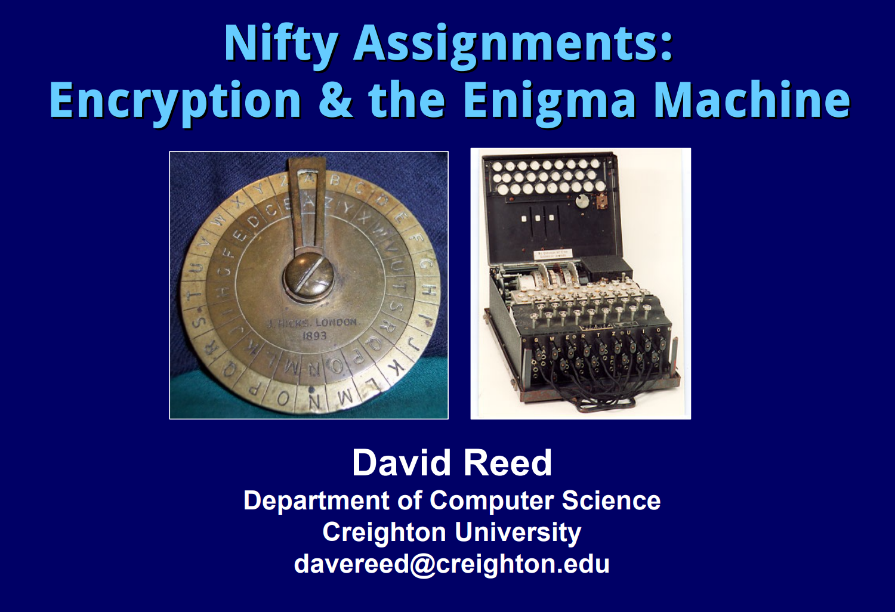
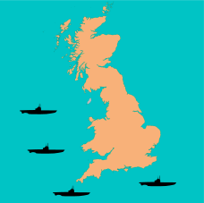
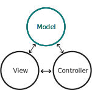

## Enigma: An Old Problem
::::::cols
:::::col
- This assignment extends and explores a similar topic to that of Dave Reed's previous Nifty Assignment from 2009
- Interested parties are encouraged to search for and check out his variation as well
:::::
:::::col

:::::
::::::

<!-- What is Enigma? -->
## World War II



## {data-background-video="../videos/Enigma.webm"}

<!-- Overview of where it fits -->
## Recreating Enigma
- The Enigma Project tasks students with creating a virtual representation of a working Enigma machine
- Teaches:
	- Classes and methods
	- **Model**-View-Controller pattern
- Requires:
	- Operations on strings and lists. Dictionary selection
	- Working with modules and interfaces
- Fits at the end of CS1 or beginning of CS2


## The Enigma Machine
{width=90%}


## Milestones
- The Enigma project is divided into a series of milestones that students can test as they go:
    - Milestone 1: Activate the keyboard when pressed
    - Milestone 2: Connect the keys directly to the lamps
    - Milestone 3: Design and implement rotors
    - Milestone 4: Implement one stage in the encryption
    - Milestone 5: Implement the full encryption path
    - Milestone 6: Make the rotors advance properly at the start of each keypress

## {data-background-iframe="https://willamette.edu/~esroberts/NiftyAssignments-2023/Milestones/index.html"}


<!-- What makes it nifty -->
## Why So Nifty?
- Appeals to a broad spectrum of students: encryption enthusiasts to history buffs to students who appreciate "real world" projects
- Small, easily understood milestones for students to approach incrementally
- Interesting extensions possible for students who progress quickly
- Students can build a full graphical application without needing to understand a complex package
- Animations and interactables to help students understand complex workings of the rotors
- Web-based demos of each of the milestones that betray none of the implementation details
- Implementations exist for both Python and Java
- Offers a dramatic way to introduce and discuss the life and work of Alan Turing


## 

:::ender
Questions?
:::


<!-- How does it operate? -->
## The Model Starter
::::::{.cols style='align-items: center;'}
::::col

::::


::::{.col .fragment .fade-left style='flex-grow:2'}
```{.python style='font-size:.70em; max-height:800px' data-line-numbers=22-44}
# File: EnigmaModel.py

""" This is the starter file for the Enigma project. """

from EnigmaView import EnigmaView

class EnigmaModel:

    def __init__(self):
        """Creates a new EnigmaModel with no views."""
        self._views = [ ]

    def add_view(self, view):
        """Adds a view to this model."""
        self._views.append(view)

    def update(self):
        """Sends an update request to all the views."""
        for view in self._views:
            view.update()

    def is_key_down(self, letter):
		# Keys are never down initially
        return False        

    def is_lamp_on(self, letter):
		# Lamps are always off initially
        return False        

    def key_pressed(self, letter):
        # You need to fill in this code
        self.update()

    def key_released(self, letter):
        # You need to fill in this code
        self.update()

    def get_rotor_letter(self, index):
		# All rotors set to "A" initially
        return "A"          

    def rotor_clicked(self, index):
        # You need to fill in this code
        self.update()

def enigma():
    """Runs the Enigma simulator."""
    model = EnigmaModel()
    view = EnigmaView(model)
    model.add_view(view)

# Startup code

if __name__ == "__main__":
    enigma()
```
::::
::::::

## Animating Away Confusion {data-state="RotorDemo"}
<div id="RotorDemo">
<canvas contenteditable="true" width="1485" height="810" style="border: none; overflow: hidden; outline-width: 0px; width: 1485px; height: 810px;"></canvas>
</div>
<td style="text-align:center;">
    <table class="CTControlStrip">
        <tbody style="border:none;">
            <tr>
                <td>
                    
                </td>
                <td>
                    
                </td>
            </tr>
        </tbody>
    </table>
</td>
